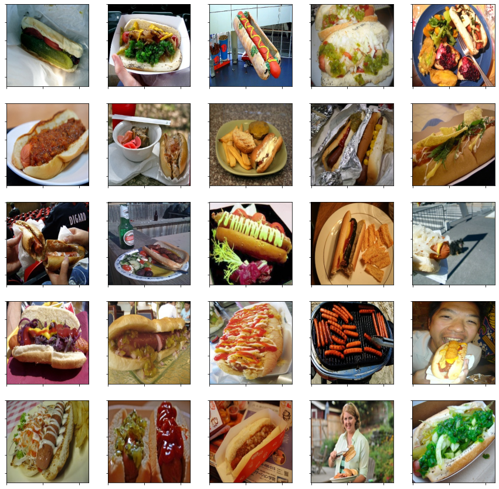
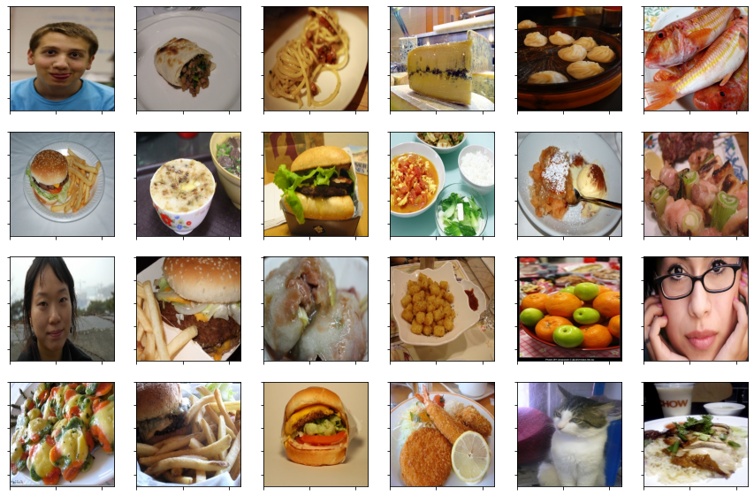

# hotdog-not-hotdog

App which classifies the given image as either a hot dog or not, inspired from Jian Yang in Silicon Valley (TV Series).  
  

 

## Data Collection :

All the images were taken using [ImageNet](http://image-net.org/download-API)'s API which gives you a collection of URLs of vaiours images, given the desired category (also called a synset). ImageNet is a database organized according to the WordNet hierarchy. To get the URLs for a particular category, we'll have to specify the WordNet ID (wnid) of the synset. Luckily, we have been provided the mapping between WordNet ID and synsets [here](http://image-net.org/archive/words.txt). For the *hotdog* cases, the synsets like 'hotdogs', 'chilidogs' and 'franfurters' were considered. For the *not-hotdog* cases, common categories like 'people', 'food', 'animals', 'faces' and some specific food categoris like 'pizza', 'burger' and 'rice' were considerd. Since some images obtained were unavailable, we had to find those and remove them as done in *cleanData.py*. We finally have around 1600 images of *hotdog* and 1800 images of *nothotdog*.  
  
PS : Jian Yang was absoltely right about data scrapping .... "That's (a) very boring work. That's scrapping the internet for thousands of food pictures." :smile:

## Data Preprocessing :
Some images which contained people in them eating hotdogs were randomly removed manually. All the images are resized to *227x227* and the pixel values are normalized by division with *255*, to make sure that their values are between 0 and 1, and can be fed to the *AlexNet*.

## Architecture
Standard *AlexNet* architecture is used as shown below, with the last layer being a sigmoid activation instead of the softmax layer, as this is a binary classification problem. The loss function used is the *log-loss* cost.

 

  
## Results
After 35 epochs, a training set accuracy of *86%* and a test set accuracy of *80%* was achieved by the model. Observing the confusion matrix, it was clear that the number of false negatives was much higher than the number of false positives. Given below are some of the false negatives observed :  
  

 
  

It can be seen that most of the hotdog images marked as *nothotdog* have multiple hotdogs on the same image, have some other dish along with a hotdog in the same image or a zoomed part of a hotdog. This is probably because a lot of images in the training set contain only one hotdog. Now, some of the false positives are show below :  
  

 

  
I honestly couldn't think of any possible explanation as to why these were marked as *hotdog* by the model :P

## Predictions
Some predictions made by the model on some random images :  
  

 

  
## The Final App - Hotdog or Not ?  
Sample images of the final app :
  

 
